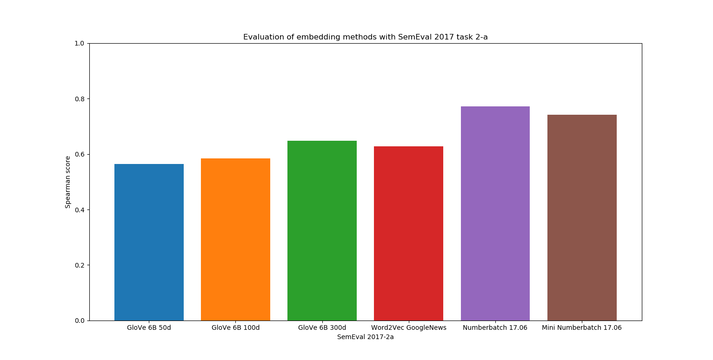
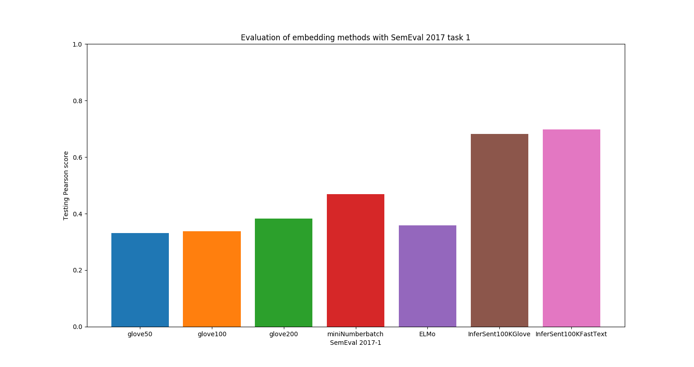
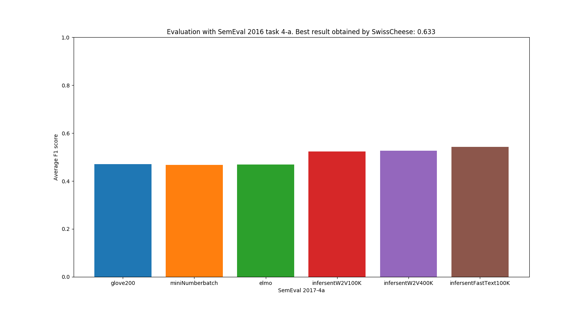

# Embedding-Comparison
Since the rise of Word Embedding and Mikolov's Word2Vec model developed in this [article](https://papers.nips.cc/paper/5021-distributed-representations-of-words-and-phrases-and-their-compositionality.pdf), a new challenge has quickly appeared: Sentence Embedding. 

In this repo, we compare different state-of-the-art sentence embedding methods and compare them in several tasks given in SemEval-2017.

# SemEval
We evaluate our models with 3 tasks from [SemEval 2017](http://alt.qcri.org/semeval2017/):
* [Task 2: Semantic Word Similarity](http://aclweb.org/anthology/S/S17/S17-2002.pdf). It focuses on Word level (Word pairs comparison).
* [Task 1: Semantic Textual Similarity](http://www.aclweb.org/anthology/S/S17/S17-2001.pdf). It focuses on Sentence level (Sentence pairs comparison).
* [Task 4: Sentiment Analysis in Twitter](http://alt.qcri.org/semeval2017/task4/data/uploads/semeval2017-task4.pdf). It focuses on Sentence level, but on a deeper one (Sentiment Analysis). 

N.B: the training for Task 4 was only done with SemEval 2016 tweets. 

# Results
* We show in Task 2 that retrofitting does improve word embedding. Indeed, the model [ConceptNet NumberBatch](https://github.com/commonsense/conceptnet-numberbatch), which uses retrofitting to "inject" ConceptNet "knowledge" in pre-trained embedding vectors, has the highest score among all the models we have tested. 

The best Pearson score (0.80) was obtained by [Luminoso_run2] using ConceptNet NumberBatch.

* We show in Task 1 and Task 4 that a sentence representation is more accurate than an average of word representations. Indeed, [InferSent](https://github.com/facebookresearch/InferSent) model has obtained higher accuracy than the other word embedding models.

The best Testing Accuracy Score (80.8) was obtained by [Yang et al. 2018](https://arxiv.org/pdf/1804.07754.pdf).

The best F1 score (0.633) for Task 4 was obtained by [SwissCheese](http://www.aclweb.org/anthology/S16-1173) model, an ensemble of Convolutional Neural Networks with Distant Supervision. 

